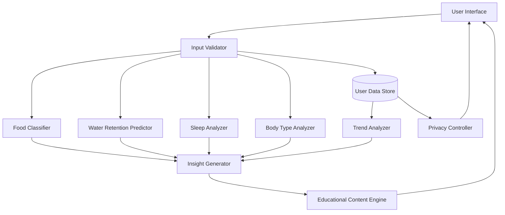

# Design Document: JeevanFit Lifestyle Assistant

## Overview

JeevanFit is an AI-powered lifestyle assistant that helps everyday users understand the relationships between their daily habits and body responses. The system architecture follows a modular design with specialized analyzers for food classification, water retention prediction, sleep impact analysis, and body type-specific insights.

The system operates as an educational platform, processing user inputs through multiple analysis pipelines and generating personalized, scientifically-grounded insights. All components are designed to maintain clear boundaries as educational tools rather than medical diagnostic systems.

### Key Design Principles

1. **Modularity**: Each analyzer (Food, Water Retention, Sleep, Body Type) operates independently with well-defined interfaces
2. **Educational Focus**: All outputs prioritize explanation and understanding over prescriptive advice
3. **Personalization**: Insights are tailored to individual body types and lifestyle patterns
4. **Safety**: Built-in safeguards prevent medical diagnosis language and redirect health concerns appropriately
5. **Privacy by Design**: User data encryption and privacy controls are fundamental, not add-ons

## Architecture

### High-Level Architecture



### Component Responsibilities

**Input Validator**
- Validates user inputs for completeness and consistency
- Sanitizes data to prevent injection attacks
- Routes validated data to appropriate analyzers

**Food Classifier**
- Categorizes food items using FSI/ISO-style parameters
- Maintains classification thresholds and rules
- Provides classification rationale

**Water Retention Predictor**
- Predicts water retention based on lifestyle factors
- Considers sodium intake, hydration, and sleep quality
- Identifies primary contributing factors

**Sleep Analyzer**
- Analyzes correlations between habits and sleep quality
- Considers food timing, caffeine, hydration, and stress
- Generates actionable sleep improvement recommendations

**Body Type Analyzer**
- Provides body type-specific metabolic insights
- Tailors recommendations to physiological characteristics
- Explains nutritional needs by body type

**Trend Analyzer**
- Identifies patterns in historical user data
- Detects correlations between habit changes and body responses
- Generates visual trend representations

**Insight Generator**
- Aggregates outputs from all analyzers
- Coordinates multi-factor analysis
- Ensures consistent insight formatting

**Educational Content Engine**
- Translates technical analysis into accessible language
- Provides cause-and-effect explanations
- Maintains educational tone and non-medical positioning

**Privacy Controller**
- Manages data encryption and access controls
- Handles data export and deletion requests
- Ensures regulatory compliance

## Components and Interfaces

### Input Validator

**Interface:**
```
validateInput(input: LifestyleInput) -> ValidationResult
  - Validates data completeness and format
  - Returns validated data or error messages

sanitizeInput(input: LifestyleInput) -> SanitizedInput
  - Removes potentially harmful data
  - Normalizes input formats
```

**Data Structures:**
```
LifestyleInput:
  - foodItems: List<FoodItem>
  - waterIntake: Volume (ml)
  - sleepDuration: Duration (hours)
  - sleepQuality: Scale (1-10)
  - dailyHabits: List<Habit>
  - timestamp: DateTime
  - userId: String

ValidationResult:
  - isValid: Boolean
  - errors: List<ValidationError>
  - validatedData: LifestyleInput | null

ValidationError:
  - field: String
  - message: String
  - suggestedFix: String
```

### Food Classifier

**Interface:**
```
classifyFood(foodItem: FoodItem) -> FoodClassification
  - Categorizes food as healthy, junk, or preservative-heavy
  - Returns classification with rationale

getFSIParameters(foodItem: FoodItem) -> FSIParameters
  - Extracts FSI/ISO-style nutritional parameters
  - Returns structured parameter data
```

**Data Structures:**
```
FoodItem:
  - name: String
  - servingSize: Number
  - unit: String
  - nutritionalInfo: NutritionalInfo

NutritionalInfo:
  - calories: Number
  - protein: Number (g)
  - carbohydrates: Number (g)
  - fat: Number (g)
  - sodium: Number (mg)
  - sugar: Number (g)
  - fiber: Number (g)
  - preservatives: List<String>
  - processingLevel: Scale (1-5)

FoodClassification:
  - category: Enum (HEALTHY, JUNK, PRESERVATIVE_HEAVY)
  - confidence: Percentage
  - rationale: String
  - dominantFactors: List<String>

FSIParameters:
  - nutrientDensity: Number
  - processingScore: Number
  - preservativeLoad: Number
  - sugarContent: Number
  - sodiumLevel: Number
```

**Classification Logic:**
- **Healthy**: High nutrient density, minimal processing (level 1-2), low preservatives, balanced macros
- **Junk**: High calories/sugar/sodium, low nutrients, high processing (level 4-5)
- **Preservative-Heavy**: Contains 3+ preservatives OR high preservative load score

**Thresholds:**
- Nutrient Density: >0.7 = healthy, <0.3 = junk
- Processing Level: 1-2 = healthy, 4-5 = junk
- Preservative Count: ≥3 = preservative-heavy
- Sugar: >15g per serving = junk (unless natural fruit)
- Sodium: >600mg per serving = junk

### Water Retention Predictor

**Interface:**
```
predictRetention(lifestyle: LifestyleInput, bodyType: BodyType) -> RetentionPrediction
  - Predicts water retention level
  - Identifies contributing factors

analyzeRetentionFactors(lifestyle: LifestyleInput) -> List<RetentionFactor>
  - Breaks down individual contributing factors
  - Ranks factors by impact
```

**Data Structures:**
```
RetentionPrediction:
  - level: Enum (LOW, MODERATE, HIGH)
  - confidence: Percentage
  - primaryFactor: RetentionFactor
  - contributingFactors: List<RetentionFactor>
  - explanation: String

RetentionFactor:
  - type: Enum (SODIUM, HYDRATION, SLEEP, HORMONAL, STRESS)
  - impact: Scale (1-10)
  - description: String
  - recommendation: String
```

**Prediction Algorithm:**
1. Calculate sodium score from food intake (high sodium = +3 points)
2. Calculate hydration score (low water = +2 points, very high water = +1 point)
3. Calculate sleep score (poor sleep = +2 points)
4. Calculate stress indicators from habits (+1-2 points)
5. Adjust for body type sensitivity
6. Total score: 0-2 = LOW, 3-5 = MODERATE, 6+ = HIGH

### Sleep Analyzer

**Interface:**
```
analyzeSleep(sleepData: SleepData, lifestyle: LifestyleInput) -> SleepAnalysis
  - Analyzes sleep quality and correlations
  - Generates improvement recommendations

identifySleepDisruptors(lifestyle: LifestyleInput) -> List<SleepDisruptor>
  - Identifies specific habits affecting sleep
  - Ranks disruptors by impact
```

**Data Structures:**
```
SleepData:
  - duration: Duration (hours)
  - quality: Scale (1-10)
  - bedtime: Time
  - wakeTime: Time
  - interruptions: Number
  - timestamp: DateTime

SleepAnalysis:
  - overallQuality: Enum (POOR, FAIR, GOOD, EXCELLENT)
  - correlations: List<SleepCorrelation>
  - recommendations: List<Recommendation>
  - explanation: String

SleepCorrelation:
  - habit: String
  - impact: Enum (POSITIVE, NEGATIVE, NEUTRAL)
  - strength: Scale (1-10)
  - description: String

SleepDisruptor:
  - type: Enum (CAFFEINE, LATE_EATING, DEHYDRATION, STRESS, SCREEN_TIME)
  - severity: Scale (1-10)
  - timing: String
  - recommendation: String

Recommendation:
  - priority: Enum (HIGH, MEDIUM, LOW)
  - action: String
  - rationale: String
  - expectedImpact: String
```

**Analysis Factors:**
- Caffeine intake within 6 hours of bedtime
- Food consumption within 3 hours of bedtime
- Hydration levels (both under and over)
- Daily stress indicators
- Screen time before bed (if tracked)

### Body Type Analyzer

**Interface:**
```
analyzeBodyType(bodyType: BodyType, lifestyle: LifestyleInput) -> BodyTypeInsight
  - Provides body type-specific insights
  - Explains metabolic responses

getMetabolicProfile(bodyType: BodyType) -> MetabolicProfile
  - Returns metabolic characteristics
  - Provides nutritional guidelines
```

**Data Structures:**
```
BodyType:
  - classification: Enum (ECTOMORPH, MESOMORPH, ENDOMORPH, MIXED)
  - characteristics: List<String>
  - userId: String

BodyTypeInsight:
  - metabolicResponse: String
  - fatStoragePattern: String
  - energyUtilization: String
  - nutritionalNeeds: NutritionalNeeds
  - lifestyleRecommendations: List<Recommendation>

MetabolicProfile:
  - baseMetabolicRate: Enum (FAST, MODERATE, SLOW)
  - carbSensitivity: Scale (1-10)
  - fatStorageTendency: Scale (1-10)
  - muscleGainPotential: Scale (1-10)
  - recoverySpeed: Scale (1-10)

NutritionalNeeds:
  - proteinRatio: Percentage
  - carbRatio: Percentage
  - fatRatio: Percentage
  - mealFrequency: String
  - hydrationGuidance: String
```

**Body Type Profiles:**

**Ectomorph:**
- Fast metabolism, difficulty gaining weight
- Lower fat storage tendency
- Higher carb tolerance
- Needs frequent meals, higher calorie intake

**Mesomorph:**
- Moderate metabolism, balanced composition
- Efficient muscle gain and fat loss
- Balanced macronutrient needs
- Responds well to varied nutrition

**Endomorph:**
- Slower metabolism, easier weight gain
- Higher fat storage tendency
- Lower carb tolerance, higher protein needs
- Benefits from controlled portions, lower carb intake

### Trend Analyzer

**Interface:**
```
analyzeTrends(userId: String, timeRange: TimeRange) -> TrendAnalysis
  - Identifies patterns over time
  - Detects significant changes

detectCorrelations(userId: String, metric1: String, metric2: String) -> Correlation
  - Finds relationships between metrics
  - Calculates correlation strength
```

**Data Structures:**
```
TrendAnalysis:
  - patterns: List<Pattern>
  - correlations: List<Correlation>
  - significantChanges: List<Change>
  - visualizations: List<ChartData>

Pattern:
  - metric: String
  - trend: Enum (INCREASING, DECREASING, STABLE, CYCLICAL)
  - confidence: Percentage
  - description: String
  - timeRange: TimeRange

Correlation:
  - metric1: String
  - metric2: String
  - strength: Scale (-1 to 1)
  - description: String
  - causality: Enum (LIKELY, POSSIBLE, UNLIKELY)

Change:
  - metric: String
  - changePoint: DateTime
  - magnitude: Number
  - description: String
  - possibleCauses: List<String>
```

### Insight Generator

**Interface:**
```
generateInsight(analysisResults: List<AnalysisResult>) -> Insight
  - Aggregates multi-analyzer outputs
  - Creates cohesive insight

prioritizeInsights(insights: List<Insight>) -> List<Insight>
  - Ranks insights by importance
  - Filters redundant information
```

**Data Structures:**
```
AnalysisResult:
  - source: Enum (FOOD, WATER, SLEEP, BODY_TYPE, TREND)
  - data: Any
  - confidence: Percentage
  - timestamp: DateTime

Insight:
  - title: String
  - summary: String
  - details: String
  - priority: Enum (HIGH, MEDIUM, LOW)
  - category: String
  - actionable: Boolean
  - relatedInsights: List<String>
```

### Educational Content Engine

**Interface:**
```
translateToEducational(insight: Insight) -> EducationalContent
  - Converts technical analysis to accessible language
  - Adds cause-and-effect explanations

ensureNonMedical(content: String) -> String
  - Validates content doesn't contain medical diagnosis language
  - Replaces problematic terms with educational alternatives
```

**Data Structures:**
```
EducationalContent:
  - mainMessage: String
  - explanation: String
  - causeEffect: List<CauseEffectPair>
  - learnMore: List<EducationalResource>
  - disclaimer: String

CauseEffectPair:
  - cause: String
  - effect: String
  - mechanism: String
  - confidence: Enum (WELL_ESTABLISHED, SUPPORTED, THEORETICAL)

EducationalResource:
  - title: String
  - description: String
  - type: Enum (ARTICLE, VIDEO, INFOGRAPHIC)
  - url: String
```

**Language Guidelines:**
- Use "may" instead of "will" for predictions
- Use "suggests" instead of "indicates" for correlations
- Avoid: "diagnosis", "treatment", "cure", "disease"
- Prefer: "pattern", "habit", "wellness", "lifestyle factor"
- Always include disclaimers for health-related content

### Privacy Controller

**Interface:**
```
encryptData(data: Any) -> EncryptedData
  - Encrypts user data using AES-256

decryptData(encrypted: EncryptedData) -> Any
  - Decrypts data for authorized access

exportUserData(userId: String) -> DataExport
  - Exports all user data in JSON format

deleteUserData(userId: String) -> DeletionConfirmation
  - Permanently deletes all user data
```

**Data Structures:**
```
EncryptedData:
  - ciphertext: String
  - iv: String
  - authTag: String
  - algorithm: String

DataExport:
  - userId: String
  - exportDate: DateTime
  - data: JSON
  - format: String

DeletionConfirmation:
  - userId: String
  - deletionDate: DateTime
  - status: Enum (SCHEDULED, IN_PROGRESS, COMPLETED)
```

## Data Models

### User Profile
```
UserProfile:
  - userId: String (UUID)
  - createdAt: DateTime
  - bodyType: BodyType
  - preferences: UserPreferences
  - consentRecords: List<ConsentRecord>

UserPreferences:
  - units: Enum (METRIC, IMPERIAL)
  - language: String
  - notificationSettings: NotificationSettings
  - privacySettings: PrivacySettings

ConsentRecord:
  - type: String
  - granted: Boolean
  - timestamp: DateTime
  - version: String
```

### Lifestyle Entry
```
LifestyleEntry:
  - entryId: String (UUID)
  - userId: String
  - timestamp: DateTime
  - foodItems: List<FoodItem>
  - waterIntake: Volume
  - sleepData: SleepData
  - dailyHabits: List<Habit>
  - notes: String

Habit:
  - type: Enum (EXERCISE, STRESS, SCREEN_TIME, CAFFEINE, ALCOHOL, OTHER)
  - intensity: Scale (1-10)
  - duration: Duration
  - timing: Time
  - notes: String
```

### Analysis History
```
AnalysisRecord:
  - recordId: String (UUID)
  - userId: String
  - timestamp: DateTime
  - analysisType: String
  - inputs: JSON
  - outputs: JSON
  - confidence: Percentage
```

### Database Schema

**Users Table:**
- user_id (PK, UUID)
- created_at (TIMESTAMP)
- body_type (ENUM)
- preferences (JSONB)
- consent_records (JSONB)
- encrypted_data_key (TEXT)

**Lifestyle_Entries Table:**
- entry_id (PK, UUID)
- user_id (FK, UUID)
- timestamp (TIMESTAMP)
- food_items (JSONB)
- water_intake (DECIMAL)
- sleep_data (JSONB)
- daily_habits (JSONB)
- notes (TEXT)

**Analysis_History Table:**
- record_id (PK, UUID)
- user_id (FK, UUID)
- timestamp (TIMESTAMP)
- analysis_type (VARCHAR)
- inputs (JSONB)
- outputs (JSONB)
- confidence (DECIMAL)

**Indexes:**
- user_id on all tables
- timestamp on Lifestyle_Entries and Analysis_History
- analysis_type on Analysis_History


## Correctness Properties

*A property is a characteristic or behavior that should hold true across all valid executions of a system—essentially, a formal statement about what the system should do. Properties serve as the bridge between human-readable specifications and machine-verifiable correctness guarantees.*

### Food Classification Properties

**Property 1: Food classification consistency**
*For any* food item with identical nutritional parameters, classifying it multiple times should always produce the same category and rationale.
**Validates: Requirements 1.4**

**Property 2: Classification rationale completeness**
*For any* food item that is classified, the classification result should include a non-empty rationale explaining the categorization.
**Validates: Requirements 1.2**

**Property 3: Dominant category selection**
*For any* food item with multiple characteristics that could place it in different categories, the classification should select the category with the highest threshold score as dominant.
**Validates: Requirements 1.3**

**Property 4: Valid classification categories**
*For any* food item, the classification result should be one of the three valid categories: HEALTHY, JUNK, or PRESERVATIVE_HEAVY.
**Validates: Requirements 1.1**

### Water Retention Properties

**Property 5: Retention prediction without exercise**
*For any* lifestyle input that excludes exercise data, the water retention predictor should still generate a valid prediction with confidence level.
**Validates: Requirements 2.1**

**Property 6: Multi-factor retention influence**
*For any* lifestyle input, varying sodium content, hydration level, or sleep quality independently should result in different retention predictions, demonstrating all factors are considered.
**Validates: Requirements 2.2**

**Property 7: Primary factor identification**
*For any* water retention prediction, the result should identify exactly one primary contributing factor from the set of analyzed factors.
**Validates: Requirements 2.5**

**Property 8: Valid retention levels**
*For any* lifestyle input, the retention prediction should return one of the valid levels: LOW, MODERATE, or HIGH.
**Validates: Requirements 2.4**

### Sleep Analysis Properties

**Property 9: Sleep correlation detection**
*For any* multi-day dataset where a specific habit consistently precedes sleep quality changes, the sleep analyzer should identify a correlation between that habit and sleep outcomes.
**Validates: Requirements 3.1**

**Property 10: Multi-factor sleep consideration**
*For any* sleep analysis, varying food timing, caffeine intake, hydration, or stress indicators independently should affect the analysis results, demonstrating all factors are considered.
**Validates: Requirements 3.2**

**Property 11: Sleep recommendations presence**
*For any* sleep analysis with sufficient data, the result should include at least one actionable recommendation for sleep improvement.
**Validates: Requirements 3.3**

**Property 12: Cause-effect explanation structure**
*For any* sleep analysis result, the explanation should contain at least one cause-effect pair linking a specific habit to a sleep outcome.
**Validates: Requirements 3.4**

**Property 13: Insufficient data handling**
*For any* sleep analysis request with incomplete required fields, the analyzer should return a validation error requesting specific missing information rather than generating a partial analysis.
**Validates: Requirements 3.5**

### Body Type Analysis Properties

**Property 14: Body type insight completeness**
*For any* body type and lifestyle input, the analysis should explain all three aspects: metabolism effects, fat storage patterns, and energy level impacts.
**Validates: Requirements 4.1**

**Property 15: Body type personalization**
*For any* identical lifestyle input analyzed with different body types, the resulting insights and recommendations should differ in meaningful ways reflecting metabolic differences.
**Validates: Requirements 4.2, 4.4**

**Property 16: Nutritional needs inclusion**
*For any* body type analysis, the result should include specific nutritional needs guidance including macronutrient ratios or meal frequency recommendations.
**Validates: Requirements 4.3**

### Educational Content Properties

**Property 17: Universal educational content**
*For any* analysis result from any analyzer (food, water, sleep, body type), the output should include educational content explaining underlying cause-and-effect relationships.
**Validates: Requirements 5.1**

**Property 18: Non-medical language enforcement**
*For any* generated insight or analysis output, the text should not contain medical diagnosis terms from the forbidden list: "diagnosis", "diagnose", "treatment", "treat", "cure", "disease", "disorder", "condition", "prescribe", "medication".
**Validates: Requirements 5.3, 8.1**

**Property 19: Contextual explanation presence**
*For any* insight about a lifestyle factor, the output should include context explaining why that factor matters for overall wellness.
**Validates: Requirements 5.4**

**Property 20: Educational disclaimer inclusion**
*For any* user-facing output containing health-related insights, the content should include a disclaimer stating JeevanFit is an educational tool, not a medical device.
**Validates: Requirements 8.3, 8.4**

### Input Validation Properties

**Property 21: Comprehensive input validation**
*For any* lifestyle input, the validator should check completeness and consistency of all required fields: food items, water intake, sleep duration, sleep quality, and daily habits.
**Validates: Requirements 6.1, 6.2**

**Property 22: Input validation error handling**
*For any* invalid or incomplete lifestyle input, the validator should return a validation error with a descriptive message identifying the specific problem and suggesting how to fix it.
**Validates: Requirements 6.3, 6.5**

**Property 23: Input persistence round-trip**
*For any* valid lifestyle input that is stored, retrieving it by user ID and timestamp should return data equivalent to the original input.
**Validates: Requirements 6.4**

### Trend Analysis Properties

**Property 24: Pattern detection in multi-day data**
*For any* user with at least 7 days of data containing a consistent increasing or decreasing trend in a metric, the trend analyzer should identify that pattern.
**Validates: Requirements 7.1**

**Property 25: Correlation detection over time**
*For any* user dataset where changes in one metric consistently precede changes in another metric, the trend analyzer should identify a correlation between those metrics.
**Validates: Requirements 7.2**

**Property 26: Historical data retrieval**
*For any* metric that has been tracked for a user, querying historical data for that metric should return all stored values within the requested time range.
**Validates: Requirements 7.4**

**Property 27: Significant change notification**
*For any* user dataset where a metric changes by more than 30% from its baseline average, the system should generate a notification explaining the detected change.
**Validates: Requirements 7.5**

### Privacy and Security Properties

**Property 28: Data encryption at rest**
*For any* user data stored in the database, the sensitive fields should be encrypted using AES-256 encryption before storage.
**Validates: Requirements 9.1**

**Property 29: Data export completeness**
*For any* user requesting data export, the exported file should contain all stored data for that user in valid JSON format including all lifestyle entries, analysis history, and profile information.
**Validates: Requirements 9.4**

### Error Handling Properties

**Property 30: Error message quality**
*For any* error condition encountered during system operation, the error message should include both a description of what went wrong and a suggestion for how to recover or correct the issue.
**Validates: Requirements 10.5**

## Error Handling

### Error Categories

**Validation Errors**
- Invalid input format
- Missing required fields
- Out-of-range values
- Inconsistent data

**Processing Errors**
- Insufficient data for analysis
- Classification ambiguity
- Correlation detection failure
- Trend analysis failure

**System Errors**
- Database connection failure
- Encryption/decryption failure
- External service unavailability
- Resource exhaustion

### Error Response Format

All errors follow a consistent structure:

```
ErrorResponse:
  - errorCode: String
  - errorType: Enum (VALIDATION, PROCESSING, SYSTEM)
  - message: String (user-friendly description)
  - details: String (technical details)
  - recoverySuggestion: String
  - timestamp: DateTime
  - requestId: String
```

### Error Handling Strategies

**Validation Errors:**
- Return immediately with descriptive error
- Include specific field that failed validation
- Suggest valid input format or range
- Do not process invalid data

**Processing Errors:**
- Log error details for debugging
- Return user-friendly explanation
- Suggest alternative actions (e.g., provide more data)
- Gracefully degrade when possible

**System Errors:**
- Log full error stack for investigation
- Return generic error to user (don't expose internals)
- Implement retry logic for transient failures
- Alert monitoring systems for critical failures

### Health Concern Detection

When user data indicates potential health concerns:

1. **Do not diagnose** - avoid medical terminology
2. **Provide educational context** - explain what the data shows
3. **Recommend professional consultation** - suggest seeing a healthcare provider
4. **Include disclaimer** - remind user JeevanFit is not medical advice

Example response:
```
"Your data shows patterns that may benefit from professional guidance. 
We recommend consulting with a healthcare provider to discuss your 
sleep patterns and overall wellness. JeevanFit is an educational tool 
and cannot provide medical advice."
```

## Testing Strategy

### Dual Testing Approach

JeevanFit requires both unit testing and property-based testing for comprehensive coverage:

**Unit Tests** focus on:
- Specific examples demonstrating correct behavior
- Edge cases (boundary values, empty inputs, extreme values)
- Error conditions and error message quality
- Integration points between components
- Specific scenarios from user stories

**Property-Based Tests** focus on:
- Universal properties that hold for all inputs
- Comprehensive input coverage through randomization
- Invariants that must be maintained
- Round-trip properties (e.g., store then retrieve)
- Consistency properties (e.g., same input → same output)

### Property-Based Testing Configuration

**Framework Selection:**
- Python: Use Hypothesis library
- TypeScript/JavaScript: Use fast-check library
- Java: Use jqwik library

**Test Configuration:**
- Minimum 100 iterations per property test
- Each test must reference its design document property
- Tag format: `Feature: fitbuddy-lifestyle-assistant, Property {number}: {property_text}`

**Example Property Test Structure:**
```python
# Feature: fitbuddy-lifestyle-assistant, Property 1: Food classification consistency
@given(food_item=food_item_strategy())
def test_food_classification_consistency(food_item):
    result1 = food_classifier.classify(food_item)
    result2 = food_classifier.classify(food_item)
    assert result1.category == result2.category
    assert result1.rationale == result2.rationale
```

### Test Coverage Requirements

**Component-Level Testing:**
- Each analyzer component: 90%+ code coverage
- Input validator: 95%+ coverage (critical path)
- Privacy controller: 100% coverage (security critical)

**Integration Testing:**
- End-to-end flows for each user story
- Multi-component interactions
- Data flow through entire pipeline

**Property Test Coverage:**
- Each correctness property must have exactly one property-based test
- Properties should be tested close to implementation (catch errors early)
- Each property test must explicitly reference the property number

### Test Data Generation

**Generators for Property Tests:**
- Food items with varied nutritional profiles
- Lifestyle inputs with different combinations of factors
- Multi-day datasets with various patterns
- Body types and metabolic profiles
- Edge cases: empty values, extreme values, boundary values

**Test Data Characteristics:**
- Realistic value ranges based on real-world data
- Include edge cases in generation strategies
- Generate both valid and invalid inputs
- Create data with known correlations for validation

### Testing Non-Functional Requirements

**Performance Testing:**
- Response time: <500ms for single analysis
- Throughput: 100+ requests/second
- Database query optimization

**Security Testing:**
- Encryption verification
- Input sanitization validation
- Access control testing
- SQL injection prevention

**Accessibility Testing:**
- Screen reader compatibility
- Keyboard navigation
- Color contrast ratios
- WCAG 2.1 AA compliance

### Continuous Testing

**Pre-commit:**
- Run unit tests
- Run linting and type checking
- Verify code formatting

**CI/CD Pipeline:**
- Run full unit test suite
- Run property-based tests (100 iterations)
- Run integration tests
- Generate coverage reports
- Run security scans

**Production Monitoring:**
- Error rate tracking
- Performance metrics
- User feedback analysis
- A/B testing for UX improvements
